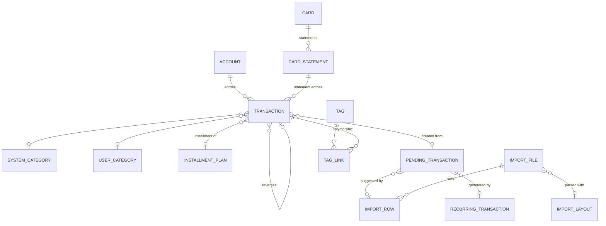

# Data Model

[← Back to index](../README.md) · Related: [Architecture](architecture.md), [Transactions](transactions.md)

PostgreSQL schema **`finances`**. Conventions across all tables: PK `uuid DEFAULT uuid_generate_v7()`,
`TIMESTAMPTZ` for timestamps, audit columns `created_by/created_at/updated_by/updated_at`, named
constraints (`pk_finXXX`, `uq_finXXX_*`, `fk_finXXX_*`, `ck_finXXX_*`), enums stored as `VARCHAR` +
`CHECK`. Every user-owned table has `user_id NOT NULL` and an index on it.

Migrations live in `migrations/migrations/finances/`.

## Table catalog

| # | Table | Contents |
|---|---|---|
| fin001 | `account` | Accounts |
| fin002 | `system_category` | System categories (seeded) |
| fin003 | `user_category` | User categories |
| fin004 | `tag` | Tags |
| fin005 | `tag_link` | Polymorphic tag ↔ entity link |
| fin006 | `card` | Credit cards |
| fin007 | `card_statement` | Statements (faturas) |
| fin008 | `transaction` | The ledger |
| fin009 | `installment_plan` | Installment plans |
| fin010 | `recurring_transaction` | Recurrence templates |
| fin011 | `pending_transaction` | Staging / inbox suggestions |
| fin012 | `import_layout` | Parsing profiles |
| fin013 | `import_file` | Uploaded files |
| fin014 | `import_row` | Parsed rows |
| fin015 | *(reserved)* | Categorization rules — **not yet implemented** |
| fin016 | `audit_event` | Append-only audit log |

---

## fin001_account

| Column | Type | Notes |
|---|---|---|
| `id` | uuid PK | |
| `user_id` | uuid NOT NULL | |
| `name` | varchar(100) NOT NULL | unique per user |
| `type` | varchar(20) NOT NULL | `cash\|checking\|savings\|international\|crypto\|investment\|other` |
| `currency` | varchar(10) NOT NULL | ISO 4217 or crypto ticker; immutable |
| `institution` | varchar(100) NULL | |
| `description` | varchar(255) NULL | |
| `color` / `icon` | varchar | display |
| `display_order` | int NOT NULL DEFAULT 0 | |
| `archived_at` | timestamptz NULL | soft archive |

Constraints: `uq_fin001_user_name (user_id, name)`, `ck_fin001_type`. Index `ix_fin001_user_id`.

## fin002_system_category

| Column | Type | Notes |
|---|---|---|
| `id` | uuid PK | |
| `code` | varchar(60) NOT NULL | globally **unique** (`housing`, `rent`, …) |
| `name` | varchar(100) NOT NULL | |
| `transaction_nature` | varchar(10) NOT NULL | `expense\|income` |
| `parent_category_id` | uuid NULL → fin002 | 2 levels max |
| `color` / `icon` | varchar | |
| `display_order` | int NOT NULL | |
| `is_other` | boolean NOT NULL DEFAULT false | group fallback child |
| `is_active` | boolean NOT NULL DEFAULT true | |
| `notes` | varchar(255) NULL | |

`created_by NULL` marks seed rows. Constraints: `uq_fin002_code`, `fk_fin002_parent_category_id`,
`ck_fin002_transaction_nature`. Seeded by migration (see [Categories & Tags](categories-and-tags.md)).

## fin003_user_category

Same shape as fin002 but scoped to `user_id`, no `code`/`is_other`/`notes`, self-referencing
`parent_category_id → fin003`. Unique `uq_fin003_user_name_parent (user_id, name, parent_category_id)`,
`ck_fin003_transaction_nature`.

## fin004_tag / fin005_tag_link

**fin004_tag:** `id`, `user_id`, `name varchar(50)`, `color varchar(20)`. Unique `(user_id, name)`.

**fin005_tag_link:** `id`, `tag_id → fin004 (ON DELETE CASCADE)`, `entity_type varchar(30)`,
`entity_id uuid` (no physical FK — polymorphic, integrity enforced in the app). Unique
`(tag_id, entity_type, entity_id)`; index `(entity_type, entity_id)`.
`ck_fin005_entity_type`: `account | card | card-statement | transaction | recurring-transaction | pending-transaction`.

## fin006_card

| Column | Type | Notes |
|---|---|---|
| `id` / `user_id` | uuid | |
| `name` | varchar(100) | unique per user |
| `brand` | varchar(50) NULL | visa, mastercard, … |
| `last_four` | varchar(4) NULL | |
| `credit_limit` | numeric(20,8) NULL | `>= 0` |
| `closing_day` | int NOT NULL | **1..28** |
| `due_day` | int NOT NULL | **1..28** |
| `currency` | varchar(10) NOT NULL | immutable |
| `default_payment_account_id` | uuid NULL → fin001 | |
| `archived_at` | timestamptz NULL | |

Constraints: `uq_fin006_user_name`, `ck_fin006_closing_day/due_day (BETWEEN 1 AND 28)`,
`ck_fin006_credit_limit`, `fk_fin006_default_payment_account_id`. Index `(user_id, archived_at)`.

> The 1..28 range avoids month-length ambiguity (no card closes on the 30th of February).

## fin007_card_statement

| Column | Type | Notes |
|---|---|---|
| `id` / `user_id` / `card_id → fin006` | uuid | |
| `reference_month` | varchar(7) | `yyyy-MM`, one per card+month |
| `closing_date` / `due_date` | date | |
| `status` | varchar(20) | `open\|closed\|partially-paid\|paid\|overdue` |
| `total_amount` | numeric(20,8) DEFAULT 0 | cache; truth = Σ statement transactions |
| `paid_amount` | numeric(20,8) DEFAULT 0 | `>= 0` |
| `closed_at` / `paid_at` / `overdue_at` | timestamptz NULL | |

Constraints: `uq_fin007_card_reference_month`, `ck_fin007_status`, `ck_fin007_reference_month (~ '^\d{4}-\d{2}$')`,
`ck_fin007_paid_amount`, `fk_fin007_card_id`. Indexes `(user_id, status, due_date)`, `(card_id, closing_date)`.

## fin008_transaction — the ledger

The central table. Built up across several migrations; final shape:

| Column | Type | Notes |
|---|---|---|
| `id` / `user_id` | uuid | `user_id` denormalized for queries |
| `account_id` | uuid NULL → fin001 | destination (XOR) |
| `card_statement_id` | uuid NULL → fin007 | destination (XOR) |
| `card_id` | uuid NULL → fin006 | denormalized when on a statement |
| `paid_statement_id` | uuid NULL → fin007 | statement paid/settled by this entry |
| `kind` | varchar(30) NOT NULL | see [Transactions](transactions.md) |
| `status` | varchar(10) DEFAULT 'posted' | `pending\|posted\|void` |
| `amount` | numeric(20,8) NOT NULL | `> 0` |
| `currency` | varchar(10) NOT NULL | = destination currency |
| `occurred_on` | date NOT NULL | the fact date (civil, no TZ) |
| `description` | varchar(255) NOT NULL | |
| `system_description` | jsonb NULL | for system-generated entries (rendered at read time) |
| `payee` | varchar(150) NULL | |
| `notes` | text NULL | |
| `system_category_id` | uuid NULL → fin002 | |
| `user_category_id` | uuid NULL → fin003 | |
| `transfer_group_id` | uuid NULL | links the out/in pair |
| `fx_rate` | numeric(20,10) NULL | cross-currency transfer/payment |
| `installment_plan_id` | uuid NULL → fin009 | |
| `installment_number` | smallint NULL | `>= 1` |
| `origin` | varchar(15) DEFAULT 'manual' | `manual\|import\|recurrence\|projection\|reversal` |
| `reversed_transaction_id` | uuid NULL → fin008 | the original this entry reverses |
| `pending_transaction_id` | uuid NULL → fin011 | provenance |
| `recurring_transaction_id` | uuid NULL → fin010 | provenance |
| `posted_at` / `voided_at` | timestamptz NULL | |
| `void_reason` | varchar(255) NULL | |

**Key constraints:**
- `ck_fin008_kind` — the full kind list (11 kinds, incl. `statement-writeoff`).
- `ck_fin008_status`, `ck_fin008_origin`, `ck_fin008_amount (> 0)`.
- `ck_fin008_target_xor` — a normal entry targets an account **XOR** a statement; a
  `statement-writeoff` targets **neither** (only `paid_statement_id`).
- `ck_fin008_paid_statement_account_only` — `paid_statement_id` is set only by
  `card-statement-payment` (with an account) or `statement-writeoff` (with neither).
- `ck_fin008_installment_pairing` — `installment_plan_id` and `installment_number` are both set or both null.
- `uq_fin008_reversed_transaction_id` — one reversal per transaction.
- `ck_fin008_reversed_transaction_not_self`.

**Indexes:** `(user_id, occurred_on)`, `(account_id, status, occurred_on)`,
`(card_statement_id, status, occurred_on)`, `(card_id, occurred_on)`, `(paid_statement_id)`,
`(transfer_group_id)`, `(installment_plan_id)`, `(pending_transaction_id)`,
`(recurring_transaction_id)`, `(reversed_transaction_id)`.

## fin009_installment_plan

| Column | Type | Notes |
|---|---|---|
| `id` / `user_id` / `card_id → fin006` | uuid | |
| `origin` | varchar(10) DEFAULT 'manual' | `manual\|import` |
| `total_amount` | numeric(20,8) | `> 0` |
| `total_is_estimate` | boolean DEFAULT false | true for import-inferred plans |
| `installment_count` | smallint | `>= 2` |
| `first_reference_month` | varchar(7) | `yyyy-MM` |
| `description` | varchar(255) | |
| `normalized_description` | varchar(255) | description without the installment marker — the match key |

Index `(card_id, normalized_description)`.

## fin010_recurring_transaction

Template + rule + execution cursor.

- **Template:** `account_id`/`card_id` (XOR, `ck_fin010_destination`), `kind`, `amount` (NULL = variable),
  `amount_is_estimate`, `description`, `payee`, `system_category_id`, `user_category_id`.
- **Rule:** `frequency` (`daily|weekly|monthly|yearly`), `interval (>=1)`, `day_of_month (1..31)`,
  `weekday (0..6)`, `start_date`, `end_date`, `max_occurrences`.
- **Execution:** `status` (`active|paused|finished`), `auto_post` (bool), `auto_generate` (bool,
  default true), `next_occurrence_on` (cursor), `occurrences_count`.

Indexes `(user_id)`, `(status, next_occurrence_on)`.

## fin011_pending_transaction — staging / inbox

| Column | Type | Notes |
|---|---|---|
| `id` / `user_id` | uuid | |
| `source` | varchar(15) | `recurrence\|import` |
| `recurring_transaction_id` | uuid NULL → fin010 | provenance (recurrence) |
| `import_row_id` | uuid NULL | provenance (import; logical FK) |
| **payload** | | `account_id`, `card_id`, `kind`, `amount`, `currency`, `occurred_on`, `description`, `payee`, `notes`, `system_category_id`, `user_category_id`, `suggested_statement_id → fin007` |
| `original_payload` | jsonb NOT NULL | **immutable** snapshot of the initial suggestion |
| `duplicate_of_transaction_id` | uuid NULL | suspected/matched duplicate of an existing transaction |
| `duplicate_of_pending_id` | uuid NULL | suspected duplicate of another pending row |
| `dedup_status` | varchar(15) NULL | `new\|certain\|suspected\|matched` (import only) |
| `installment_number` / `installment_count` | smallint NULL | detected parcela |
| `matched_installment_plan_id` | uuid NULL | plan matched at approval |
| `status` | varchar(10) DEFAULT 'pending' | `pending\|approved\|rejected` |
| `decided_at` / `decided_by` | | |
| `rejection_reason` | varchar(255) NULL | also `linked-to-existing-transaction` |
| `transaction_id` | uuid NULL → fin008 | created on approval |

Constraints: `ck_fin011_source`, `ck_fin011_status`, `ck_fin011_recurrence_source` (recurrence ⇒
`recurring_transaction_id`), `ck_fin011_import_source` (import ⇒ `import_row_id`),
`ck_fin011_dedup_status`. **Idempotency:** unique `(recurring_transaction_id, occurred_on)` — a
recurrence never generates the same date twice. Indexes `(user_id, status)`,
`(recurring_transaction_id)`, `(import_row_id)`.

## fin012_import_layout

Parsing profiles. System layouts have `user_id NULL` and a globally unique `layout_code`
(`uq_fin012_system_layout_code`). Columns: `layout_code`, `name`, `bank_name`, `file_format`
(`ofx|csv`), `account_type` (`account|card`), `config jsonb`. The `config` carries all
parser-specific options (OFX quirks, CSV column mapping, decimal separator, sign convention,
`installmentPatterns`). Seeded with layouts for Viacredi, Nubank, Banco Inter, Itaú — see
[Imports](imports.md).

## fin013_import_file

| Column | Type | Notes |
|---|---|---|
| `id` / `user_id` | uuid | |
| `layout_id` | uuid NULL → fin012 | NULL when detection failed |
| `account_id` / `card_id` | uuid NULL | destination (XOR, `ck_fin013_destination`) |
| `file_name` | varchar(255) | |
| `file_hash` | varchar(64) | sha256 hex — **informational only, not unique** (user may re-import intentionally) |
| `file_content` | bytea | raw bytes (re-read on retry) |
| `file_size` | int | |
| `cutoff_date` | date NULL | onboarding: rows before this date are skipped |
| `correlation_id` | uuid NOT NULL | ties the whole import's audit together |
| `status` | varchar(15) DEFAULT 'received' | `received\|parsing\|completed\|failed\|aborted` |
| counters | int | `total_rows`, `parsed_rows`, `error_rows`, `duplicate_rows`, `suggestion_rows` |
| `retry_count` | int | fault tolerance |
| `error_message` | text NULL | |
| `started_at` / `completed_at` | timestamptz NULL | |

Indexes `(user_id, status)`, partial `(status, created_at) WHERE status='received'` (job queue),
`(correlation_id)`.

## fin014_import_row

| Column | Type | Notes |
|---|---|---|
| `id` / `import_file_id → fin013` | uuid | |
| `row_index` | int | |
| `raw_data` | text | original bytes preserved |
| `parsed_payload` | jsonb NULL | structured interpretation |
| `external_id` | varchar(255) NULL | FITID or CSV identifier column |
| `dedup_key` | varchar(64) NULL | sha256 of identity fields |
| `dedup_status` | varchar(15) DEFAULT 'new' | `new\|certain\|suspected\|matched` |
| `matched_transaction_id` | uuid NULL | existing transaction (certain/suspected) |
| `matched_pending_transaction_id` | uuid NULL | existing pending suggestion (recurrence match) |
| `installment_number` / `installment_count` | smallint NULL | detected parcela |
| `matched_installment_plan_id` | uuid NULL | |
| `pending_transaction_id` | uuid NULL | the suggestion created for this row |
| `status` | varchar(20) DEFAULT 'pending' | `pending\|suggestion-created\|skipped\|error` |
| `error_message` | text NULL | |

FKs to fin011/fin008 are **logical only** (no physical FK) to avoid cross-import coupling. Indexes
`(import_file_id)`, partial `(dedup_key)`, `(external_id)`, `(pending_transaction_id)`.

## fin016_audit_event — append-only

| Column | Type | Notes |
|---|---|---|
| `id` / `user_id` | uuid | `user_id` = data owner |
| `actor_user_id` | uuid NULL | who acted (NULL = system/job) |
| `entity_type` | varchar(40) | `transaction`, `pending-transaction`, `import-file`, … |
| `entity_id` | uuid | |
| `event_type` | varchar(60) | `transaction.created`, `pending.approved`, … |
| `data` | jsonb NULL | diff `{ field: { old, new } }` and/or event detail |
| `correlation_id` | uuid NULL | groups everything from one operation |
| `occurred_at` | timestamptz NOT NULL | |

Indexes `(entity_type, entity_id, occurred_at)`, `(user_id, occurred_at)`. No `UPDATE`/`DELETE`
by application policy. See [Audit & Provenance](audit-and-provenance.md).

## Entity relationships (simplified)

