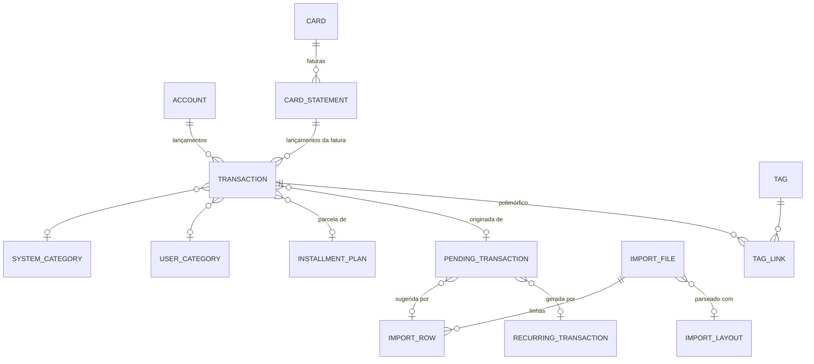

# Módulo Finances — Análise de Negócio e Design

> Status: proposta de design (v1) — 2026-06-10
> Escopo: controle financeiro pessoal completo dentro do monolito modular Pandora.

---

## 1. Visão geral

O módulo **Finances** dá ao usuário controle completo sobre suas finanças pessoais:

- Cadastro de **contas** (dinheiro, conta corrente, poupança, internacional, crypto, investimento) e **cartões de crédito** com ciclo completo de **faturas**.
- **Lançamentos** (transações) diretos em conta ou em fatura de cartão: entrada, saída, transferência, aporte, resgate, rentabilidade, pagamento de fatura, estorno, ajuste.
- **Categorias do sistema** (seed, hierárquicas) + **categorias customizadas do usuário** — campos separados, um lançamento pode ter as duas.
- **Tags** livres, atreláveis a qualquer entidade (conta, cartão, transação, recorrência…).
- **Transações recorrentes** que geram sugestões automaticamente.
- **Importação de extratos** (OFX e CSV, com layouts configuráveis por banco) para conta e cartão.
- **Inbox de revisão** unificado: tudo que é gerado automaticamente (importação, recorrência) vira uma *transação pendente* que o usuário edita, aprova ou rejeita.
- **Auditoria e proveniência completas**: todo evento relevante fica registrado, e toda transação sabe de onde veio (linha X do arquivo Y, ocorrência da recorrência Z, edição manual do campo W).

### Princípios

1. **Ledger é a fonte da verdade.** Saldo nunca é um campo editável: é derivado das transações postadas. Nada "ajusta saldo na mão" — ajustes são transações (`adjustment`), auditáveis como qualquer outra.
2. **Nada automático entra direto no ledger sem rastro.** Importação e recorrência passam por staging (ou são auto-postadas com flag explícita do usuário), e a cadeia de proveniência é estrutural, não só log textual.
3. **Append-only para auditoria.** Eventos de auditoria nunca são alterados ou apagados.
4. **Modelo preparado para evoluir** (orçamentos, metas, split de transação, open finance) sem reescrever o core.

---

## 2. Conceitos do domínio (linguagem ubíqua)

| Termo | Significado |
|---|---|
| **Account (Conta)** | Repositório de saldo do usuário: carteira/dinheiro, conta corrente, poupança, conta internacional, crypto, investimento. Tem moeda fixa. |
| **Card (Cartão)** | Cartão de crédito. **Não é uma conta**: gastos vão para a fatura; só o pagamento da fatura movimenta uma conta. Cartão de débito não é cadastrado — débito é lançamento direto na conta. |
| **Statement (Fatura)** | Ciclo mensal de um cartão: agrupa transações entre fechamentos, tem data de fechamento, vencimento e status (aberta → fechada → paga/vencida). |
| **Transaction (Lançamento)** | Movimento atômico no ledger. Afeta exatamente **um destino**: uma conta OU uma fatura de cartão. Transferência = duas transações ligadas. |
| **Transfer group** | Par de transações (`transfer_out` na origem + `transfer_in` no destino) ligadas por um id comum. Suporta moedas diferentes (com taxa de câmbio registrada). |
| **Installment plan (Parcelamento)** | Compra parcelada no cartão: um plano + N transações, uma por fatura. |
| **System category** | Categoria mantida pelo sistema (seed), hierárquica (pai → filho), tipada por natureza (despesa/receita). Global, igual para todos os usuários. |
| **User category** | Categoria criada pelo usuário, também hierárquica. Campo separado: um lançamento pode ter categoria do sistema **e** do usuário ao mesmo tempo. |
| **Tag** | Rótulo livre do usuário, aplicável a qualquer entidade do módulo via vínculo polimórfico. |
| **Recurring transaction (Recorrência)** | Template de lançamento + regra de repetição. Gera transações pendentes (ou posta direto, se `auto_post`). |
| **Pending transaction (Transação pendente / sugestão)** | Registro de staging: proposta de lançamento vinda de importação ou recorrência. Editável; aprovação cria a transação real; rejeição encerra. Guarda snapshot do que foi sugerido originalmente. |
| **Import file / Import row** | Arquivo de extrato enviado (OFX/CSV) e cada linha/registro extraído dele, com dado bruto preservado. |
| **Import layout** | Perfil de parsing para CSV (e quirks de OFX por banco): mapeamento de colunas, formato de data, separador decimal, convenção de sinal, padrões de detecção de parcela. |
| **Conciliação (reconciliation)** | Casamento de uma linha importada com um lançamento já existente ou *esperado* (agendado, gerado por recorrência, parcela projetada). Aprovar concilia: confirma/posta o existente com os valores reais, sem duplicar. |
| **Categorization rule** | Regra do usuário ("descrição contém UBER → transporte/ride-hailing") aplicada na geração de sugestões. |
| **Audit event** | Registro append-only de qualquer mudança relevante: quem, quando, em quê, o quê mudou (diff), com correlação. |

---

## 3. Funcionalidades

### 3.1 Contas
- CRUD de contas com tipo (`cash`, `checking`, `savings`, `international`, `crypto`, `investment`, `other`), moeda (ISO 4217 ou ticker crypto), instituição, cor/ícone, ordem de exibição.
- Saldo inicial registrado como transação `opening_balance` (ledger puro, auditável).
- Arquivamento (soft, `archived_at`) — conta arquivada não recebe lançamentos novos mas preserva histórico.
- Saldo atual, saldo projetado (incluindo pendentes/agendadas), extrato com filtros.

### 3.2 Cartões e faturas
- CRUD de cartões: bandeira, final do cartão, limite, dia de fechamento, dia de vencimento, conta padrão de pagamento.
- Faturas geradas por ciclo (uma por mês de referência), criadas sob demanda quando o primeiro lançamento do ciclo chega — e adiantadas pelo job de ciclo de vida.
- Lançamento em fatura: o sistema resolve a fatura-alvo pela data da compra e dia de fechamento; o usuário pode forçar outra fatura.
- **Parcelamento**: compra em N parcelas gera plano + N transações distribuídas nas faturas seguintes.
- Estorno/crédito em fatura (`refund`), reduzindo o total.
- Fechamento automático na data de fechamento (job); depois de fechada, lançamentos novos caem na próxima.
- **Pagamento de fatura**: transação `card_statement_payment` saindo de uma conta, vinculada à fatura. Suporta pagamento parcial (fatura fica `partially_paid`) e múltiplos pagamentos.
- Visões: fatura atual/anteriores/futuras, total, pago, restante, vencimentos próximos, limite disponível (limite − faturas em aberto).

### 3.3 Lançamentos
- Tipos (`kind`): `opening_balance`, `income`, `expense`, `transfer_in`, `transfer_out`, `investment_contribution` (aporte), `investment_redemption` (resgate), `yield` (rentabilidade), `card_statement_payment`, `refund`, `adjustment`.
- Valor sempre positivo; a direção (entra/sai) é função do `kind`.
- Status: `pending` (agendada/futura, não afeta saldo), `posted` (efetivada), `void` (cancelada — nunca deletada fisicamente depois de postada).
- Campos: data do fato (`occurred_on`), descrição, favorecido/pagador (`payee`), observações, categoria do sistema, categoria do usuário, tags.
- Transferência entre contas (inclusive moedas diferentes, com `fx_rate` e valores em cada moeda).
- Edição e cancelamento sempre auditados com diff de campos.

### 3.4 Categorias
- **Sistema**: seed completo hierárquico (2 níveis), nos moldes do exemplo `fin002` — ~20 grupos pai (Housing, Food, Transport, Health, …, Primary Income, Investment Income, …) e ~120 filhos, com `code`, `color`, `icon`, `display_order`, `is_other` (fallback do grupo) e `is_active`. Atualizável por migration sem tocar nos dados do usuário.
- **Usuário**: CRUD próprio, também hierárquico, tipado por natureza (`expense`/`income`), com cor/ícone. Tabela e FK separadas da categoria de sistema.
- Um lançamento pode ter `system_category_id` e `user_category_id` simultaneamente — análises podem cruzar as duas dimensões.
- Desativação de categoria não quebra lançamentos antigos (FK permanece; categoria some só de novos cadastros).

### 3.5 Tags
- CRUD de tags (nome único por usuário, cor).
- Vínculo polimórfico: conta, cartão, fatura, transação, recorrência, transação pendente.
- Filtros e análises por tag em qualquer visão.

### 3.6 Recorrências
- Template do lançamento (destino conta/cartão, kind, valor — fixo ou estimado —, descrição, payee, categorias) + regra de repetição: frequência (`daily`/`weekly`/`monthly`/`yearly`), intervalo, dia do mês / dia da semana, data inicial, término (data, nº de ocorrências ou indefinido).
- Job gera ocorrências dentro de um horizonte (ex.: 30 dias à frente) como **transações pendentes**.
- `auto_post`: para contas fixas de valor exato, o usuário pode optar por postar direto (sem revisão) — ainda assim com proveniência e auditoria completas.
- Pausar/retomar/encerrar recorrência; editar template afeta só ocorrências futuras.

### 3.7 Importação de extratos
- Upload de **OFX** e **CSV** (outros formatos no futuro — o design isola o parser por trás de uma porta).
- Destino: uma conta ou um cartão (extrato de cartão alimenta faturas).
- **Layouts**: perfis de parsing por banco — providos pelo sistema (seed dos bancos comuns) e criáveis pelo usuário para CSV (mapeamento de colunas, formato de data, separador decimal, convenção de sinal, linhas de cabeçalho a pular, encoding).
- Pipeline assíncrono: arquivo recebido → parsing → linhas extraídas (dado bruto preservado) → deduplicação → sugestões criadas → revisão do usuário → concluído.
- **Deduplicação e conciliação** (três níveis de confiança, por linha):
  - hash do arquivo (mesmo arquivo enviado 2x → aviso, exige confirmação para reprocessar);
  - **duplicata certa** (`duplicate_existing`): OFX com mesmo `FITID` já importado na mesma conta/cartão, ou linha idêntica de arquivo reprocessado → não gera sugestão por padrão; a linha fica visível, com link para o lançamento existente, e pode ser forçada;
  - **suspeita de duplicata** (`suspect_duplicate`): heurística — mesma conta/cartão + data (±2 dias) + mesmo valor (+ similaridade de descrição como desempate) → **gera sugestão normalmente**, sinalizada como possível duplicata e com link para o lançamento parecido; o usuário decide no inbox: aprovar (lançar mesmo assim) ou rejeitar (ignorar);
  - **conciliação** (`matched_existing`): a linha casa com um lançamento *esperado* — agendado (`pending`), gerado por recorrência ou parcela projetada de plano → a sugestão vira uma **confirmação**: aprovar atualiza/posta o lançamento existente com os valores reais, em vez de criar um novo.
- Regras de categorização aplicadas na geração da sugestão (categoria sugerida + confiança).
- **Detecção de parcelas em extrato de cartão**: vários bancos exportam a fatura sem campo estruturado de parcela — só descrição e valor da parcela corrente (ex.: `LOJA X 03/12`, R$ 100). O layout define padrões de extração (regex; os layouts de sistema cobrem os formatos comuns: `3/12`, `03/12`, `PARC 3/12`, `3 de 12`); o parser extrai `installment_number`/`installment_count` para o payload e a sugestão. Na aprovação, o sistema casa a parcela com um plano de parcelamento existente ou cria um retroativamente (fluxo 8.7).

### 3.8 Inbox de revisão (staging)
- Fila única de **transações pendentes**, origem importação ou recorrência.
- Usuário pode: editar qualquer campo proposto, aprovar (cria a transação real), rejeitar, aprovar em lote.
- O registro guarda o **payload original imutável** (o que foi sugerido) e o estado atual editado — diff disponível a qualquer momento.
- Sugestões marcadas como **possível duplicata** exibem o lançamento existente lado a lado; aprovar = lançar mesmo assim, rejeitar = ignorar.
- Sugestões **conciliadas** com lançamento esperado (agendado, recorrência, parcela projetada) são aprovadas como confirmação: o lançamento existente é atualizado com os valores reais e postado — nada duplica.
- Aprovação liga `pending_transaction.transaction_id`; a transação criada referencia a pendente. Cadeia completa: `transaction → pending_transaction → import_row → import_file` (ou `→ recurring_transaction`).

### 3.9 Auditoria
- **Proveniência estrutural** (FKs da cadeia acima) + **log de eventos append-only** (`fin016_audit_event`).
- Todo evento relevante registrado com ator, timestamp, entidade, tipo de evento, diff de campos (JSONB) e `correlation_id` (agrupa tudo de uma mesma operação — ex.: uma importação inteira).
- Exemplo respondível pelo modelo: *"a transação T veio da linha 42 do arquivo `extrato-nubank-maio.ofx`, sugerida com descrição `PAG*JoseSilva` e categoria `other-expense`; o usuário editou a descrição para `Aluguel maio` e a categoria para `rent` em 2026-06-10 14:32, e aprovou às 14:33"* — sem precisar de texto livre: cada passo é um evento estruturado.

### 3.10 Consultas e visões
- Saldo por conta e consolidado (por moeda; consolidação multi-moeda convertida fica para fase futura com provedor de câmbio).
- Extrato/movimentações com filtros: período, conta/cartão, kind, categoria (sistema e/ou usuário), tag, texto, origem (manual/import/recorrência), status.
- Fluxo de caixa mensal (entradas × saídas), evolução de saldo.
- Fatura: detalhe, totais, pagamentos, parcelamentos em andamento.
- Agenda: vencimentos de fatura + pendentes agendados + próximas recorrências.
- Análise por categoria (drill-down pai → filho, sistema × usuário), por tag, por payee.

### 3.11 Sugestões de features adicionais (incorporadas ao design)
Estas não estavam no pedido original, mas o modelo já as suporta ou as deixa baratas:

| Feature | Status no design |
|---|---|
| **Parcelamento de cartão** | Incluído na v1 (essencial no Brasil). |
| **Regras de categorização** (auto-categorizar importações) | Incluído na v1 — tabela própria, aplicada no pipeline de sugestão. |
| **Agendamento de lançamento único** (status `pending` com data futura) | Incluído na v1 — mesmo mecanismo de status. |
| **Split de transação** (um lançamento, várias categorias) | Futuro — adicionar `fin0xx_transaction_split` filho; quando existir split, a categoria vale no nível do split. Não quebra o modelo. |
| **Orçamentos** (teto por categoria/mês) | Futuro — módulo de leitura sobre o ledger + tabela de metas por categoria. |
| **Metas/objetivos** (juntar X até Y) | Futuro. |
| **Anexos/comprovantes** em transações | Futuro — tabela de attachment + storage. |
| **Snapshot de saldo** (performance com histórico grande) | Futuro — tabela mensal materializada por conta; o ledger continua sendo a verdade. |
| **Open finance / sincronização automática** (Pluggy etc.) | Futuro — entra pelo mesmo pipeline de import (novo "formato"). |
| **Exportação** (CSV/OFX/JSON) | Futuro, trivial sobre as queries de extrato. |

---

## 4. Decisões de design (e alternativas descartadas)

### D1 — Saldo derivado do ledger
**Decisão:** saldo = Σ transações `posted` da conta (incluindo a `opening_balance`). Cacheável, nunca editável.
**Alternativa descartada:** campo `balance` na conta atualizado imperativamente — fonte clássica de inconsistência e inauditável.
**Consequência:** correção de saldo é uma transação `adjustment`; performance com histórico grande se resolve depois com snapshots mensais, sem mudar o modelo.

### D2 — Cartão não é conta; fatura é entidade central
**Decisão:** gasto de cartão vai para a **fatura**; só o pagamento da fatura toca uma conta. Modelo bate com o mental do usuário brasileiro (fatura, fechamento, vencimento, parcelamento).
**Alternativa descartada:** cartão como "conta de passivo" (estilo contabilidade/ledger duplo). Mais elegante contabilmente, porém pior UX e complica fatura/parcelamento — e nada impede evoluir depois, já que tudo é transação.

### D3 — Transferência = duas transações ligadas
**Decisão:** `transfer_out` na origem + `transfer_in` no destino, mesmas `transfer_group_id`. Cada transação afeta exatamente um destino — saldo é sempre um somatório simples por conta.
**Alternativa descartada:** uma linha com `from/to` — complica todo somatório e quebra a regra "uma transação, um destino"; modelo de lançamentos com "pernas" (double-entry completo) — exagero para finanças pessoais.
**Consequência:** consistência do par é garantida pelo domínio (serviço de domínio cria/edita/cancela os dois juntos, na mesma transação de banco).

### D4 — Staging unificado para tudo que é automático
**Decisão:** importação e recorrência produzem o **mesmo** tipo de registro (`pending_transaction`), com origem discriminada. Uma inbox, um fluxo de aprovação, uma auditoria.
**Alternativa descartada:** staging separado por origem — duplicaria fluxo, telas e auditoria.

### D5 — Categoria do sistema e do usuário em tabelas e FKs separadas
**Decisão:** `fin002_system_category` (global, seed, sem `user_id`) e `fin003_user_category` (por usuário). Transação tem `system_category_id` **e** `user_category_id`, ambas opcionais e independentes.
**Alternativa descartada:** tabela única com flag `is_system` — mistura ciclo de vida (seed por migration × CRUD do usuário), arrisca o usuário "editar" categoria global e complica permissão.

### D6 — Auditoria: proveniência estrutural + event log
**Decisão:** duas camadas. (a) FKs de proveniência (`transaction → pending → import_row → import_file` / `→ recurring`); (b) `fin016_audit_event` append-only com diffs JSONB para toda mutação.
**Alternativa descartada:** event sourcing completo — custo alto para o benefício; o híbrido cobre 100% do requisito de auditoria.

### D7 — Dinheiro como `NUMERIC(20,8)` + código de moeda
**Decisão:** valor `NUMERIC(20,8)` (cobre BRL com 2 casas e crypto com 8), `currency VARCHAR(10)` (ISO 4217 + tickers tipo `BTC`, `USDT`). Transação herda a moeda da conta/cartão de destino; transferência multi-moeda guarda os dois valores e a `fx_rate`.
**Alternativa descartada:** inteiro em unidades mínimas (cents) — ótimo para moeda única, ruim para expoentes variáveis de crypto.

### D8 — Fatura como aggregate próprio (não filho do cartão)
**Decisão:** `Card` e `CardStatement` são aggregates separados, ligados por `card_id`. Fatura muda com frequência e independentemente (totais, pagamentos, fechamento); carregar o cartão inteiro a cada lançamento seria contenção desnecessária.
**Consequência:** consistência entre cartão e fatura (ex.: limite disponível) é eventual/calculada em query, não invariante de aggregate — aceitável, pois limite não é "hard constraint" em finanças pessoais.

### D9 — Conciliação: importação confirma o que era esperado, não duplica
**Decisão:** o detector de duplicatas trabalha em três níveis — **duplicata certa** (não sugere por padrão), **suspeita** (sugestão sinalizada; usuário decide lançar mesmo assim ou ignorar) e **conciliação** (a linha casa com um lançamento *esperado* — agendado, gerado por recorrência ou parcela projetada — e a aprovação confirma/posta o existente com os valores reais, em vez de criar um novo).
**Alternativa descartada:** tratar tudo como binário "novo ou duplicata" — recorrências e parcelas projetadas seriam sistematicamente duplicadas quando o mesmo fato chegasse via extrato.
**Consequência:** recorrência + importação convivem (a conta de luz gerada pela recorrência é *confirmada* pelo extrato), e parcelamentos detectados em CSV conciliam mês a mês com as parcelas projetadas.

---

## 5. Modelo de domínio

Módulo `Pottmayer.Pandora.Modules.Finances`, espelhando Identity/Notifications:

```
Modules/Finances/
  ...Finances.Abstractions      → contratos públicos p/ outros módulos
  ...Finances.Application       → Commands, Queries, Dtos, Services, DI
  ...Finances.Contracts         → IntegrationEvents
  ...Finances.Domain            → Aggregates, Entities, ValueObjects, Errors, Ports
  ...Finances.Infrastructure    → Jobs (recorrência, fechamento, parsing), parsers OFX/CSV, DI
  ...Finances.Persistence       → EntityConfigs, Repositories, ValueConverters, DI
  ...Finances.Presentation      → Controllers, Requests, DI
```

### 5.1 Aggregates

| Aggregate root | Entidades internas | Responsabilidade / invariantes principais |
|---|---|---|
| **Account** | — | Config da conta. Invariantes: moeda imutável após criação; arquivada não aceita lançamento novo. |
| **Card** | — | Config do cartão. Invariantes: `closing_day`/`due_day` ∈ 1..28 (evita ambiguidade de mês); moeda imutável. |
| **CardStatement** | — | Ciclo da fatura. Invariantes: única por (cartão, mês de referência); transições válidas de status; `paid_amount ≤ total` (com tolerância p/ crédito); fechada não recebe lançamento (vai pra próxima). |
| **Transaction** | — | Movimento no ledger. Invariantes: exatamente um destino (conta XOR fatura); `amount > 0`; kind compatível com destino (ex.: `yield` só em conta, `refund` em fatura ou conta); `posted` não pode ser editada em valor/destino — corrige-se com `void` + nova (mantém auditoria honesta); `void` é terminal. |
| **InstallmentPlan** | — | Parcelamento: nº de parcelas ≥ 2; `installment_number` único por plano; soma das parcelas = total quando `origin = manual` (planos inferidos de importação têm total estimado). |
| **UserCategory** | — | Categoria do usuário: hierarquia de 2 níveis (filho não pode ter filho); tipo do filho = tipo do pai. |
| **Tag** | — | Nome único por usuário. |
| **RecurringTransaction** | — | Template + regra. Invariantes: regra válida (frequência/intervalo/término coerentes); cursor `next_occurrence_on` só avança; pausada não gera. |
| **PendingTransaction** | — | Staging. Invariantes: `original_payload` imutável após criação; transições `pending → approved/rejected` terminais; aprovação cria a Transaction — ou, em modo conciliação, atualiza/posta o lançamento casado (`matched_transaction_id`). |
| **ImportFile** | ImportRow (acesso via repositório, não carregadas juntas — podem ser milhares) | Pipeline do arquivo: transições de status; hash p/ dedup; contadores agregados. |
| **ImportLayout** | — | Perfil de parsing; layouts de sistema (`user_id NULL`) não são editáveis pelo usuário. |
| **CategorizationRule** | — | Regra de match; prioridade única por usuário (ordem de aplicação determinística). |

`SystemCategory` é **dado de referência** (seed, leitura): não precisa de aggregate com comportamento — entidade de leitura + repositório read-only.
`AuditEvent` é **store append-only**: gravado via port (`IAuditTrail`), nunca lido pelo domínio para decisão.

### 5.2 Value objects

- `Money` (amount + currency) — soma/subtração só entre moedas iguais.
- `CurrencyCode` — ISO 4217 ou ticker permitido.
- `StatementPeriod` (ano/mês de referência) — resolve datas de fechamento/vencimento a partir do cartão.
- `RecurrenceRule` (frequency, interval, day-of-month/weekday, start, end) — calcula próximas ocorrências.
- `TransactionKind`, `AccountType`, `StatementStatus`, `PendingStatus`, `ImportStatus`, … (enums).
- `ProvenanceRef` (origem: manual | import | recurrence + refs).

### 5.3 Ports (Domain.Ports)

- Repositories: `IAccountRepository`, `ICardRepository`, `ICardStatementRepository`, `ITransactionRepository`, `IRecurringTransactionRepository`, `IPendingTransactionRepository`, `IImportFileRepository`, `IImportRowRepository`, `IImportLayoutRepository`, `IUserCategoryRepository`, `ISystemCategoryReader`, `ITagRepository`, `ICategorizationRuleRepository`, `IInstallmentPlanRepository`.
- Services: `IStatementResolver` (compra + cartão → fatura-alvo), `ITransferService` (cria/edita/cancela o par), `IStatementPaymentService`, `IRecurrenceGenerator`, `IImportParser` (estratégias OFX/CSV por trás), `IDuplicateDetector` (duplicata certa / suspeita / conciliação com lançamento esperado), `IInstallmentPlanMatcher` (casa parcela importada com plano existente ou cria um retroativamente), `ICategorySuggester`, `IAuditTrail`, `IBalanceCalculator`.

---

## 6. Modelo de dados

Schema **`finances`**, prefixo **`finXXX_`**, seguindo as convenções do projeto: PK `uuid DEFAULT uuid_generate_v7()`, `TIMESTAMPTZ`, colunas de auditoria `created_by/created_at/updated_by/updated_at`, constraints nomeadas (`pk_finXXX`, `uq_finXXX_*`, `fk_finXXX_*`, `ck_finXXX_*`). Enums como `VARCHAR` + `CHECK` (legível em SQL, sem tipo custom).

Todas as tabelas com dado do usuário têm `user_id UUID NOT NULL REFERENCES identity.idt001_user(id)` e índice por `user_id` (multi-tenant por usuário; também denormalizado em `fin008_transaction` para performance de consulta).

### Catálogo

| # | Tabela | Conteúdo |
|---|---|---|
| fin001 | `account` | Contas |
| fin002 | `system_category` | Categorias do sistema (seed) |
| fin003 | `user_category` | Categorias do usuário |
| fin004 | `tag` | Tags |
| fin005 | `tag_link` | Vínculo polimórfico tag ↔ entidade |
| fin006 | `card` | Cartões |
| fin007 | `card_statement` | Faturas |
| fin008 | `transaction` | Lançamentos (ledger) |
| fin009 | `installment_plan` | Planos de parcelamento |
| fin010 | `recurring_transaction` | Recorrências |
| fin011 | `pending_transaction` | Staging / sugestões |
| fin012 | `import_layout` | Perfis de parsing |
| fin013 | `import_file` | Arquivos importados |
| fin014 | `import_row` | Linhas extraídas |
| fin015 | `categorization_rule` | Regras de categorização |
| fin016 | `audit_event` | Log de auditoria append-only |

### fin001_account
```sql
id                uuid PK DEFAULT uuid_generate_v7()
user_id           uuid NOT NULL → idt001_user
name              varchar(100) NOT NULL
type              varchar(20) NOT NULL  -- cash|checking|savings|international|crypto|investment|other
currency          varchar(10) NOT NULL  -- 'BRL','USD','BTC',...
institution       varchar(100) NULL
description       varchar(255) NULL
color             varchar(20) NULL
icon              varchar(50) NULL
display_order     int NOT NULL DEFAULT 0
archived_at       timestamptz NULL
-- audit cols
UNIQUE (user_id, name)
```

### fin002_system_category
```sql
id                  uuid PK
code                varchar(60) NOT NULL UNIQUE   -- 'housing','rent',...
name                varchar(100) NOT NULL
transaction_nature  varchar(10) NOT NULL          -- expense|income
parent_category_id  uuid NULL → fin002 (2 níveis máx.)
color               varchar(20) NULL
icon                varchar(50) NULL
display_order       int NOT NULL
is_other            boolean NOT NULL DEFAULT false -- fallback do grupo
is_active           boolean NOT NULL DEFAULT true
notes               varchar(255) NULL
-- audit cols (created_by NULL = seed)
```
Seed por migration, nos moldes do exemplo já levantado (20 grupos pai / ~120 filhos: Housing, Food, Transport, Health, Education, Personal Care, Family, Shopping, Entertainment, Travel, Financial Expenses, Subscriptions, Work Expenses, Pets, Misc Expense; Primary Income, Investment Income, Sales Income, Support Income, Misc Income). Cada grupo tem um filho `is_other = true`.

### fin003_user_category
```sql
id                  uuid PK
user_id             uuid NOT NULL → idt001_user
name                varchar(100) NOT NULL
transaction_nature  varchar(10) NOT NULL          -- expense|income
parent_category_id  uuid NULL → fin003
color               varchar(20) NULL
icon                varchar(50) NULL
display_order       int NOT NULL DEFAULT 0
is_active           boolean NOT NULL DEFAULT true
-- audit cols
UNIQUE (user_id, name, parent_category_id)
```

### fin004_tag / fin005_tag_link
```sql
-- fin004_tag
id        uuid PK
user_id   uuid NOT NULL → idt001_user
name      varchar(50) NOT NULL
color     varchar(20) NULL
-- audit cols
UNIQUE (user_id, name)

-- fin005_tag_link
id           uuid PK
tag_id       uuid NOT NULL → fin004
entity_type  varchar(30) NOT NULL  -- account|card|card_statement|transaction|recurring_transaction|pending_transaction
entity_id    uuid NOT NULL         -- sem FK física (polimórfico); integridade garantida na aplicação
-- audit cols
UNIQUE (tag_id, entity_type, entity_id)
INDEX (entity_type, entity_id)
```

### fin006_card
```sql
id                          uuid PK
user_id                     uuid NOT NULL → idt001_user
name                        varchar(100) NOT NULL
brand                       varchar(30) NULL      -- visa|mastercard|amex|elo|...
last_four_digits            char(4) NULL
credit_limit                numeric(20,8) NULL
currency                    varchar(10) NOT NULL
closing_day                 smallint NOT NULL CHECK (1..28)
due_day                     smallint NOT NULL CHECK (1..28)
default_payment_account_id  uuid NULL → fin001
color / icon / display_order / archived_at
-- audit cols
UNIQUE (user_id, name)
```

### fin007_card_statement
```sql
id               uuid PK
user_id          uuid NOT NULL → idt001_user
card_id          uuid NOT NULL → fin006
reference_month  date NOT NULL          -- dia 1 do mês de referência
closing_date     date NOT NULL
due_date         date NOT NULL
status           varchar(20) NOT NULL   -- open|closed|partially_paid|paid|overdue
total_amount     numeric(20,8) NOT NULL DEFAULT 0  -- cache; verdade = Σ transações da fatura
paid_amount      numeric(20,8) NOT NULL DEFAULT 0
closed_at        timestamptz NULL
paid_at          timestamptz NULL
-- audit cols
UNIQUE (card_id, reference_month)
INDEX (user_id, status, due_date)
```

### fin008_transaction (ledger)
```sql
id                        uuid PK
user_id                   uuid NOT NULL → idt001_user        -- denormalizado p/ consulta
-- destino: exatamente UM dos dois
account_id                uuid NULL → fin001
card_statement_id         uuid NULL → fin007
card_id                   uuid NULL → fin006                 -- denormalizado quando em fatura
kind                      varchar(30) NOT NULL
  -- opening_balance|income|expense|transfer_in|transfer_out|investment_contribution|
  -- investment_redemption|yield|card_statement_payment|refund|adjustment
status                    varchar(10) NOT NULL DEFAULT 'posted'  -- pending|posted|void
amount                    numeric(20,8) NOT NULL CHECK (amount > 0)
currency                  varchar(10) NOT NULL               -- = moeda da conta/cartão
occurred_on               date NOT NULL                      -- data do fato
description               varchar(255) NOT NULL
payee                     varchar(150) NULL
notes                     text NULL
system_category_id        uuid NULL → fin002
user_category_id          uuid NULL → fin003
-- transferência
transfer_group_id         uuid NULL                          -- liga o par out/in
fx_rate                   numeric(20,10) NULL
-- parcelamento
installment_plan_id       uuid NULL → fin009
installment_number        smallint NULL
-- pagamento de fatura
paid_statement_id         uuid NULL → fin007                 -- fatura quitada por esta transação
-- proveniência
origin                    varchar(15) NOT NULL DEFAULT 'manual'  -- manual|import|recurrence|projection
pending_transaction_id    uuid NULL → fin011
recurring_transaction_id  uuid NULL → fin010
posted_at                 timestamptz NULL
voided_at                 timestamptz NULL
void_reason               varchar(255) NULL
-- audit cols
CHECK ( (account_id IS NOT NULL) <> (card_statement_id IS NOT NULL) )  -- XOR destino
INDEX (user_id, occurred_on)
INDEX (account_id, status, occurred_on)
INDEX (card_statement_id)
INDEX (transfer_group_id), INDEX (installment_plan_id), INDEX (recurring_transaction_id)
```

Saldo de conta: `Σ signed(kind, amount)` sobre `status='posted'` da conta. Total de fatura: `Σ signed` das transações da fatura (cache em `fin007.total_amount`, recalculado de forma transacional a cada mutação). Parcelas futuras projetadas (`origin='projection'`) nascem com `status='pending'` nas faturas seguintes: entram no **total previsto** da fatura (visão), mas não no `total_amount` postado nem no saldo.

### fin009_installment_plan
```sql
id                     uuid PK
user_id                uuid NOT NULL
card_id                uuid NOT NULL → fin006
origin                 varchar(10) NOT NULL DEFAULT 'manual'  -- manual|import
total_amount           numeric(20,8) NOT NULL
total_is_estimate      boolean NOT NULL DEFAULT false  -- true p/ plano inferido de importação (parcela × count)
installment_count      smallint NOT NULL CHECK (>= 2)
first_reference_month  date NOT NULL                   -- inferida retroativamente qdo criado a partir da parcela N
description            varchar(255) NOT NULL
normalized_description varchar(255) NOT NULL           -- descrição sem o marcador de parcela; chave de casamento
-- audit cols
INDEX (card_id, normalized_description)
```

### fin010_recurring_transaction
```sql
id                  uuid PK
user_id             uuid NOT NULL
name                varchar(100) NOT NULL
-- template (espelha os campos relevantes de fin008)
account_id          uuid NULL → fin001
card_id             uuid NULL → fin006     -- XOR com account_id
kind                varchar(30) NOT NULL
amount              numeric(20,8) NULL     -- NULL = valor variável (sugestão sem valor)
amount_is_estimate  boolean NOT NULL DEFAULT false
description         varchar(255) NOT NULL
payee               varchar(150) NULL
system_category_id  uuid NULL
user_category_id    uuid NULL
-- regra
frequency           varchar(10) NOT NULL   -- daily|weekly|monthly|yearly
interval            smallint NOT NULL DEFAULT 1
day_of_month        smallint NULL          -- p/ monthly/yearly (1..31, clamp p/ fim de mês)
weekday             smallint NULL          -- p/ weekly (0..6)
start_date          date NOT NULL
end_date            date NULL
max_occurrences     smallint NULL
-- execução
status              varchar(10) NOT NULL DEFAULT 'active'  -- active|paused|finished
auto_post           boolean NOT NULL DEFAULT false
next_occurrence_on  date NOT NULL          -- cursor do gerador
occurrences_count   int NOT NULL DEFAULT 0
-- audit cols
```

### fin011_pending_transaction (staging)
```sql
id                        uuid PK
user_id                   uuid NOT NULL
source                    varchar(15) NOT NULL   -- import|recurrence
import_row_id             uuid NULL → fin014
recurring_transaction_id  uuid NULL → fin010
-- payload proposto (editável até decisão)
account_id / card_id / kind / amount / currency / occurred_on /
description / payee / notes / system_category_id / user_category_id
suggested_statement_id    uuid NULL → fin007
suggestion_confidence     numeric(3,2) NULL      -- da regra de categorização
-- duplicata / conciliação
duplicate_of_transaction_id uuid NULL → fin008   -- suspeita: lançamento parecido já existente
matched_transaction_id      uuid NULL → fin008   -- conciliação: lançamento esperado a confirmar
-- parcela detectada (editável pelo usuário até a decisão)
installment_number        smallint NULL
installment_count         smallint NULL
matched_installment_plan_id uuid NULL → fin009   -- plano casado na sugestão, se houver
original_payload          jsonb NOT NULL         -- snapshot IMUTÁVEL da sugestão inicial
-- decisão
status                    varchar(10) NOT NULL DEFAULT 'pending'  -- pending|approved|rejected
decided_at                timestamptz NULL
decided_by                uuid NULL → idt001_user
rejection_reason          varchar(255) NULL
transaction_id            uuid NULL → fin008     -- criada na aprovação (ou confirmada, em conciliação)
-- audit cols
INDEX (user_id, status)
CHECK (source='import' AND import_row_id IS NOT NULL OR source='recurrence' AND recurring_transaction_id IS NOT NULL)
```

### fin012_import_layout
```sql
id          uuid PK
user_id     uuid NULL → idt001_user   -- NULL = layout de sistema (seed)
name        varchar(100) NOT NULL
format      varchar(10) NOT NULL      -- ofx|csv
config      jsonb NOT NULL
  -- csv: { delimiter, encoding, dateFormat, decimalSeparator, headerRows,
  --        columns: { date, amount, description, ... }, signConvention, invertSign,
  --        installmentPatterns: [regex p/ extrair parcela da descrição, ex.: '(\d{1,2})\s*/\s*(\d{1,2})'] }
  -- ofx: { encodingOverride, dateQuirks, ... }
is_active   boolean NOT NULL DEFAULT true
-- audit cols
```

### fin013_import_file
```sql
id                 uuid PK
user_id            uuid NOT NULL
target_account_id  uuid NULL → fin001
target_card_id     uuid NULL → fin006        -- XOR com account
layout_id          uuid NULL → fin012
format             varchar(10) NOT NULL      -- ofx|csv
original_filename  varchar(255) NOT NULL
file_hash          char(64) NOT NULL         -- sha256; UNIQUE (user_id, file_hash)
file_content       bytea NOT NULL            -- bruto preservado (v1; object storage no futuro)
status             varchar(15) NOT NULL      -- received|parsing|parsed|reviewing|completed|failed|aborted
row_count_total / row_count_suggested / row_count_duplicated / row_count_failed  int
error_message      text NULL
correlation_id     uuid NOT NULL             -- amarra toda a auditoria da importação
-- audit cols
```

### fin014_import_row
```sql
id                      uuid PK
import_file_id          uuid NOT NULL → fin013
line_number             int NOT NULL
raw_content             text NOT NULL          -- linha CSV crua / bloco STMTTRN do OFX
parsed_payload          jsonb NULL             -- campos normalizados extraídos
external_id             varchar(255) NULL      -- FITID (OFX)
dedup_status            varchar(25) NOT NULL   -- unique|duplicate_in_file|duplicate_existing|suspect_duplicate|matched_existing
matched_transaction_id  uuid NULL → fin008     -- lançamento existente/esperado casado (duplicata ou conciliação)
status                  varchar(15) NOT NULL   -- parsed|suggested|skipped|failed
error_message           text NULL
pending_transaction_id  uuid NULL → fin011
-- audit cols
UNIQUE (import_file_id, line_number)
INDEX (external_id)
```

### fin015_categorization_rule
```sql
id                  uuid PK
user_id             uuid NOT NULL
priority            int NOT NULL              -- ordem de aplicação; UNIQUE (user_id, priority)
match_field         varchar(20) NOT NULL      -- description|payee
match_type          varchar(10) NOT NULL      -- contains|equals|regex
pattern             varchar(255) NOT NULL
system_category_id  uuid NULL → fin002
user_category_id    uuid NULL → fin003
is_active           boolean NOT NULL DEFAULT true
-- audit cols
```

### fin016_audit_event (append-only)
```sql
id              uuid PK
user_id         uuid NOT NULL          -- dono do dado
actor_user_id   uuid NULL              -- quem agiu (NULL = sistema/job)
entity_type     varchar(40) NOT NULL   -- 'transaction','pending_transaction','import_file',...
entity_id       uuid NOT NULL
event_type      varchar(60) NOT NULL   -- 'transaction.created','pending.edited','pending.approved',
                                       -- 'import.row-parsed','statement.closed','transaction.voided',...
data            jsonb NULL             -- diff { field: { old, new } } e/ou detalhes do evento
correlation_id  uuid NULL
occurred_at     timestamptz NOT NULL
INDEX (entity_type, entity_id, occurred_at)
INDEX (user_id, occurred_at)
-- Sem UPDATE/DELETE — política de aplicação; particionamento por tempo se crescer.
```

### Diagrama (simplificado)



---

## 7. Ciclos de vida (máquinas de estado)

**Transaction**
```
pending ──post──▶ posted ──void──▶ void (terminal)
pending ──void──▶ void
```
`posted` não admite edição de valor/destino/kind — corrige-se com `void` + novo lançamento (par auditável). Campos "cosméticos" (descrição, categorias, tags, notas) são editáveis com diff auditado.

**CardStatement**
```
open ──(closing_date atingida / job)──▶ closed
closed ──pagamento parcial──▶ partially_paid ──quitação──▶ paid (terminal)
closed|partially_paid ──(due_date vencida / job)──▶ overdue ──pagamento──▶ paid
```

**PendingTransaction**
```
pending ──aprovar──▶ approved (terminal, cria Transaction)
pending ──rejeitar──▶ rejected (terminal)
```

**ImportFile**
```
received ─▶ parsing ─▶ parsed ─▶ reviewing ─▶ completed
   │            └─▶ failed                └─▶ aborted (usuário descarta)
```

**RecurringTransaction**: `active ⇄ paused`, `active ─▶ finished` (end_date/max_occurrences atingidos).

---

## 8. Fluxos principais

### 8.1 Lançamento manual em conta
1. Command `CreateTransaction` valida conta (ativa, do usuário), kind compatível, categorias/tags.
2. Cria `Transaction` `posted` (ou `pending` se data futura/agendado).
3. Evento `transaction.created` no audit trail.

### 8.2 Compra no cartão (com parcelamento)
1. Usuário informa cartão, valor, data, parcelas (default 1).
2. `IStatementResolver` resolve a fatura-alvo (compra após o fechamento → próxima fatura); cria a fatura se não existir.
3. N=1: uma transação na fatura. N≥2: cria `InstallmentPlan` + N transações (`installment_number` 1..N) nas faturas consecutivas.
4. Totais das faturas afetadas recalculados na mesma transação de banco.

### 8.3 Fechamento e pagamento de fatura
1. Job diário fecha faturas com `closing_date <= hoje` (`statement.closed` + integration event).
2. Pagamento: command `PayStatement(statementId, accountId, amount)` cria transação `card_statement_payment` na conta com `paid_statement_id`; fatura atualiza `paid_amount`/status. Pagamento parcial e múltiplos pagamentos suportados.
3. Job marca `overdue` após o vencimento sem quitação (+ integration event para notificação).

### 8.4 Recorrência
1. Usuário cria `RecurringTransaction` (template + regra + `auto_post`).
2. Job de geração roda diariamente: para cada recorrência ativa com ocorrências dentro do horizonte (30 dias), gera `PendingTransaction` (source=recurrence) — ou posta direto se `auto_post` — e avança o cursor.
3. Idempotência: cursor `next_occurrence_on` + verificação de pendente/transação já gerada para a mesma (recorrência, data).

### 8.5 Importação
1. Upload → `ImportFile` (`received`), hash verificado (duplicado → aviso, exige confirmação).
2. Job de parsing: escolhe parser pelo formato + layout, extrai `ImportRow`s preservando `raw_content`; falhas de linha não abortam o arquivo (linha `failed`).
3. Dedup/conciliação por linha (`IDuplicateDetector`):
   - **duplicata certa** (FITID já importado / linha idêntica) → não gera sugestão (linha visível, forçável);
   - **suspeita** (data ±2d + mesmo valor + similaridade de descrição) → gera sugestão sinalizada com `duplicate_of_transaction_id`;
   - **conciliação** (casa com lançamento esperado: agendado, recorrência, parcela projetada) → gera sugestão de confirmação com `matched_transaction_id`.
4. Para as demais linhas: extrai parcela pelos padrões do layout (`installment_number`/`installment_count`), aplica `CategorizationRule`s (primeira que casa, por prioridade) e cria `PendingTransaction` (source=import) com `original_payload` congelado.
5. Usuário revisa no inbox: edita (cada edição = evento com diff), aprova (cria a `Transaction` — ou confirma/posta a casada, em conciliação) ou rejeita.
6. Arquivo vai a `completed` quando todas as linhas estão decididas; contadores atualizados.
7. Tudo amarrado pelo `correlation_id` do arquivo — a auditoria de uma importação inteira sai em uma query.

### 8.6 Transferência
1. Command `CreateTransfer(fromAccount, toAccount, amountOut, amountIn?, fxRate?)`.
2. `ITransferService` cria o par `transfer_out`/`transfer_in` com `transfer_group_id` comum, na mesma transação de banco. Moedas iguais: `amountIn = amountOut`. Diferentes: ambos informados + `fx_rate`.
3. Void de transferência cancela o par inteiro.

### 8.7 Parcelas vindas de importação (CSV de fatura sem dado estruturado)
Cenário: o CSV da fatura traz só a descrição e o valor da parcela corrente — ex.: linha `LOJA X 03/12`, R$ 100, sem nenhum campo dizendo que é a 3ª de 12.

1. O parser extrai, pelos `installmentPatterns` do layout, `installment_number = 3` e `installment_count = 12`; a sugestão exibe esses campos e permite corrigi-los (ou zerá-los, em falso positivo — ex.: descrição que só parece fração).
2. Na aprovação, o `IInstallmentPlanMatcher` procura plano existente no cartão: mesma `normalized_description` (descrição sem o marcador de parcela), mesmo `installment_count`, valor de parcela compatível (tolerância para arredondamento) e a posição N ainda livre.
   - **Achou** → a transação aprovada vira a parcela N do plano existente.
   - **Não achou** → cria plano com `origin = 'import'`, `total_amount = valor × count` (`total_is_estimate = true`) e `first_reference_month` inferida retroativamente (mês da fatura atual − (N−1) meses); a transação aprovada é a parcela N.
3. **Parcelas futuras** (N+1..count): geradas como transações `pending` com `origin = 'projection'` nas faturas seguintes — o usuário enxerga o comprometimento das próximas faturas.
4. **Parcelas passadas** (1..N−1): não são geradas automaticamente (as faturas antigas podem nem existir no sistema); o plano apenas registra o que é conhecido. Se o usuário importar uma fatura antiga depois, as linhas conciliam com o plano normalmente.
5. Importação do mês seguinte: a linha `LOJA X 04/12` casa com a parcela projetada (mesmo plano, posição 4) → sugestão de **confirmação**; aprovar posta a projeção com os valores reais da linha. Nada duplica.

---

## 9. Auditoria e proveniência

Dois mecanismos complementares:

1. **Proveniência estrutural** — FKs respondem "de onde veio": `Transaction.pending_transaction_id → PendingTransaction.import_row_id → ImportRow.import_file_id` (ou `→ recurring_transaction_id`). `ImportRow.raw_content` preserva o dado bruto; `PendingTransaction.original_payload` preserva a sugestão inicial.
2. **Event log** (`fin016_audit_event`) — responde "o que aconteceu e o que mudou": toda mutação relevante grava um evento com ator, diff JSONB e `correlation_id`. Implementação: os aggregates emitem domain events; um handler/interceptor na pipeline de Application persiste no audit trail dentro da mesma unidade de trabalho (auditoria nunca fica para trás do dado).

Catálogo inicial de `event_type` (extensível): `account.created/updated/archived`, `card.*`, `statement.created/closed/payment-received/paid/overdue`, `transaction.created/posted/edited/voided`, `recurring.created/updated/paused/resumed/finished/occurrence-generated`, `pending.created/edited/approved/approved-as-confirmation/rejected`, `import.file-received/parsing-started/row-parsed/row-failed/row-duplicated/row-matched/completed/failed/aborted`, `installment-plan.created/installment-attached/projection-generated`, `category.*`, `tag.*`, `rule.*`.

---

## 10. Jobs de background (Infrastructure/Jobs)

Mesmo padrão do `NotificationDispatcherBackgroundService`:

| Job | Frequência | Função |
|---|---|---|
| `RecurrenceGenerationService` | diário (e on-demand ao criar/editar recorrência) | Gera pendentes/posta `auto_post` dentro do horizonte. |
| `StatementLifecycleService` | diário | Cria faturas próximas, fecha vencidas de fechamento, marca `overdue`. |
| `ImportParsingService` | fila (polling) | Processa arquivos `received` de forma assíncrona. |

Todos idempotentes e auditados (ator = sistema, `actor_user_id NULL`).

---

## 11. Eventos de integração (Contracts)

Para outros módulos (Notifications é o consumidor óbvio):

- `StatementClosed` (fatura fechou: valor, vencimento) → notificação "sua fatura fechou".
- `StatementDueSoon` (X dias antes do vencimento) → lembrete.
- `StatementOverdue` → alerta.
- `ImportCompleted` (n sugestões aguardando revisão) → "você tem N lançamentos para revisar".
- `PendingTransactionsGenerated` (recorrências do período) → idem.

---

## 12. API (Presentation — esboço)

Prefixo `/api/finances`, tudo autenticado e escopado ao usuário do token:

| Recurso | Endpoints principais |
|---|---|
| `/accounts` | CRUD, `POST {id}/archive`, `GET {id}/balance`, `GET {id}/transactions` |
| `/cards` | CRUD, `POST {id}/archive`, `GET {id}/statements`, `GET {id}/available-limit` |
| `/statements` | `GET {id}` (detalhe + lançamentos), `POST {id}/pay`, `POST {id}/close` (manual) |
| `/transactions` | `GET` (filtros ricos), `POST` (conta/cartão, c/ parcelas), `PUT {id}` (campos editáveis), `POST {id}/void`, `POST transfer` |
| `/categories/system` | `GET` (árvore) |
| `/categories` | CRUD das do usuário |
| `/tags` | CRUD, `POST /tags/{id}/links`, `DELETE /tags/{id}/links/{...}` |
| `/recurring-transactions` | CRUD, `POST {id}/pause`, `POST {id}/resume` |
| `/pending-transactions` | `GET` (inbox c/ filtros), `PUT {id}` (editar proposta), `POST {id}/approve`, `POST {id}/reject`, `POST /approve-batch` |
| `/imports` | `POST` (upload multipart), `GET {id}` (status + contadores), `GET {id}/rows`, `POST {id}/abort` |
| `/import-layouts` | `GET` (sistema + do usuário), CRUD das do usuário |
| `/categorization-rules` | CRUD, reordenação de prioridade |
| `/reports` | `GET /cash-flow`, `GET /by-category`, `GET /balance-history`, `GET /upcoming` (agenda de vencimentos) |
| `/audit` | `GET /audit?entityType=&entityId=` (timeline da entidade), `GET /audit?correlationId=` |

---

## 13. Roadmap sugerido

> A ordem oficial de implementação, quebrada em 13 fases entregáveis com escopo e critérios de aceite, está em [roadmap/](roadmap/README.md). As 4 macro-fases abaixo são a visão agregada.

**Fase 1 — Core do ledger**
Schema + migrations (fin001–fin008, fin016), aggregates Account/Card/CardStatement/Transaction, categorias (seed sistema + CRUD usuário), tags, lançamentos manuais, transferências, faturas com fechamento/pagamento manual, audit trail desde o primeiro commit, saldo e extrato.

**Fase 2 — Automação**
Parcelamento (fin009), recorrências (fin010) + job de geração, staging/inbox (fin011), job de ciclo de fatura, integration events → Notifications.

**Fase 3 — Importação**
Layouts (fin012), upload + pipeline OFX (fin013/fin014), depois CSV com layouts customizados, dedup, regras de categorização (fin015), tela de revisão em lote.

**Fase 4 — Análise e conforto**
Relatórios (fluxo de caixa, categoria, histórico de saldo), agenda de vencimentos, exportação; depois orçamentos, metas, split de transação, anexos, snapshots de saldo, consolidação multi-moeda, open finance.

A ordem mantém cada fase entregável de ponta a ponta (back + front) e o ledger estável desde a fase 1 — tudo que vem depois só **escreve através** dele.

---

## 14. Questões em aberto

1. **Fuso horário de `occurred_on`**: tratado como data "civil" do usuário (DATE, sem TZ). Confirmar que o front sempre manda a data local do usuário.
2. **Limite do cartão como restrição**: hoje é informativo (sem bloqueio ao estourar). Validar se deve haver aviso/bloqueio.
3. **Fatura em moeda ≠ conta de pagamento** (cartão internacional pago com conta BRL): v1 registra o pagamento na moeda da conta + `fx_rate`; revisar quando houver consolidação multi-moeda.
4. **Retenção do `file_content` (bytea)**: manter para sempre, expurgar após N meses, ou mover para object storage? v1 mantém no banco.
5. **Auto-post de recorrência em cartão**: postar direto na fatura sem revisão é desejável ou cartão sempre passa por staging?
6. **Multiusuário/compartilhamento** (contas conjuntas/household): fora do escopo v1; o `user_id` em tudo deixa a evolução possível (trocar por `owner_id` + tabela de membros).
7. **Calibração da heurística de duplicata**: janela de ±2 dias e o peso da similaridade de descrição são chutes iniciais — calibrar com extratos reais (e avaliar torná-los configuráveis por usuário/layout).
8. **Backfill de parcelas passadas**: ao criar plano a partir da parcela N (importação), oferecer geração opcional das parcelas 1..N−1 em faturas passadas? Afeta histórico e totais de faturas antigas — default é não gerar.
9. **Projeção de parcelas futuras**: gerar sempre (default proposto) ou opt-in na aprovação? Projeções aparecem nas faturas futuras como previsto, então o default "sempre" parece o comportamento esperado.
