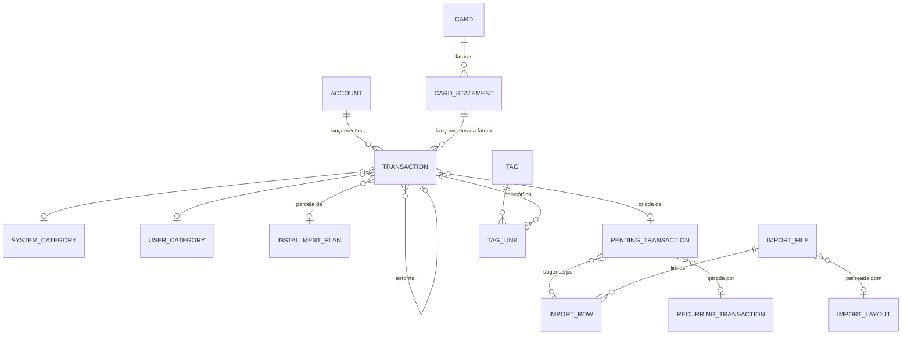

# Modelo de dados

[← Voltar ao índice](README.md) · Relacionados: [Arquitetura](architecture.md), [Lançamentos](transactions.md)

Schema PostgreSQL **`finances`**. Convenções em todas as tabelas: PK `uuid DEFAULT uuid_generate_v7()`,
`TIMESTAMPTZ` para timestamps, colunas de auditoria `created_by/created_at/updated_by/updated_at`,
constraints nomeadas (`pk_finXXX`, `uq_finXXX_*`, `fk_finXXX_*`, `ck_finXXX_*`), enums como `VARCHAR` +
`CHECK`. Toda tabela de dado do usuário tem `user_id NOT NULL` e índice por ele.

Migrations em `migrations/migrations/finances/`.

## Catálogo de tabelas

| # | Tabela | Conteúdo |
|---|---|---|
| fin001 | `account` | Contas |
| fin002 | `system_category` | Categorias do sistema (seed) |
| fin003 | `user_category` | Categorias do usuário |
| fin004 | `tag` | Tags |
| fin005 | `tag_link` | Vínculo polimórfico tag ↔ entidade |
| fin006 | `card` | Cartões de crédito |
| fin007 | `card_statement` | Faturas |
| fin008 | `transaction` | O ledger |
| fin009 | `installment_plan` | Planos de parcelamento |
| fin010 | `recurring_transaction` | Templates de recorrência |
| fin011 | `pending_transaction` | Staging / sugestões do inbox |
| fin012 | `import_layout` | Perfis de parsing |
| fin013 | `import_file` | Arquivos importados |
| fin014 | `import_row` | Linhas parseadas |
| fin015 | *(reservado)* | Regras de categorização — **ainda não implementado** |
| fin016 | `audit_event` | Log de auditoria append-only |

---

## fin001_account

| Coluna | Tipo | Notas |
|---|---|---|
| `id` | uuid PK | |
| `user_id` | uuid NOT NULL | |
| `name` | varchar(100) NOT NULL | único por usuário |
| `type` | varchar(20) NOT NULL | `cash\|checking\|savings\|international\|crypto\|investment\|other` |
| `currency` | varchar(10) NOT NULL | ISO 4217 ou ticker crypto; imutável |
| `institution` | varchar(100) NULL | |
| `description` | varchar(255) NULL | |
| `color` / `icon` | varchar | exibição |
| `display_order` | int NOT NULL DEFAULT 0 | |
| `archived_at` | timestamptz NULL | arquivamento soft |

Constraints: `uq_fin001_user_name (user_id, name)`, `ck_fin001_type`. Índice `ix_fin001_user_id`.

## fin002_system_category

| Coluna | Tipo | Notas |
|---|---|---|
| `id` | uuid PK | |
| `code` | varchar(60) NOT NULL | **único** global (`housing`, `rent`, …) |
| `name` | varchar(100) NOT NULL | |
| `transaction_nature` | varchar(10) NOT NULL | `expense\|income` |
| `parent_category_id` | uuid NULL → fin002 | 2 níveis máx. |
| `color` / `icon` | varchar | |
| `display_order` | int NOT NULL | |
| `is_other` | boolean NOT NULL DEFAULT false | filho fallback do grupo |
| `is_active` | boolean NOT NULL DEFAULT true | |
| `notes` | varchar(255) NULL | |

`created_by NULL` marca linhas de seed. Constraints: `uq_fin002_code`, `fk_fin002_parent_category_id`,
`ck_fin002_transaction_nature`. Populado por migration (ver [Categorias e tags](categories-and-tags.md)).

## fin003_user_category

Mesma forma da fin002 mas escopada a `user_id`, sem `code`/`is_other`/`notes`, `parent_category_id`
auto-referenciando `fin003`. Único `uq_fin003_user_name_parent (user_id, name, parent_category_id)`,
`ck_fin003_transaction_nature`.

## fin004_tag / fin005_tag_link

**fin004_tag:** `id`, `user_id`, `name varchar(50)`, `color varchar(20)`. Único `(user_id, name)`.

**fin005_tag_link:** `id`, `tag_id → fin004 (ON DELETE CASCADE)`, `entity_type varchar(30)`,
`entity_id uuid` (sem FK física — polimórfico, integridade garantida na aplicação). Único
`(tag_id, entity_type, entity_id)`; índice `(entity_type, entity_id)`.
`ck_fin005_entity_type`: `account | card | card-statement | transaction | recurring-transaction | pending-transaction`.

## fin006_card

| Coluna | Tipo | Notas |
|---|---|---|
| `id` / `user_id` | uuid | |
| `name` | varchar(100) | único por usuário |
| `brand` | varchar(50) NULL | visa, mastercard, … |
| `last_four` | varchar(4) NULL | |
| `credit_limit` | numeric(20,8) NULL | `>= 0` |
| `closing_day` | int NOT NULL | **1..28** |
| `due_day` | int NOT NULL | **1..28** |
| `currency` | varchar(10) NOT NULL | imutável |
| `default_payment_account_id` | uuid NULL → fin001 | |
| `archived_at` | timestamptz NULL | |

Constraints: `uq_fin006_user_name`, `ck_fin006_closing_day/due_day (BETWEEN 1 AND 28)`,
`ck_fin006_credit_limit`, `fk_fin006_default_payment_account_id`. Índice `(user_id, archived_at)`.

> A faixa 1..28 evita ambiguidade com o tamanho do mês (nenhum cartão fecha no dia 30 de fevereiro).

## fin007_card_statement

| Coluna | Tipo | Notas |
|---|---|---|
| `id` / `user_id` / `card_id → fin006` | uuid | |
| `reference_month` | varchar(7) | `yyyy-MM`, uma por cartão+mês |
| `closing_date` / `due_date` | date | |
| `status` | varchar(20) | `open\|closed\|partially-paid\|paid\|overdue` |
| `total_amount` | numeric(20,8) DEFAULT 0 | cache; verdade = Σ transações da fatura |
| `paid_amount` | numeric(20,8) DEFAULT 0 | `>= 0` |
| `closed_at` / `paid_at` / `overdue_at` | timestamptz NULL | |

Constraints: `uq_fin007_card_reference_month`, `ck_fin007_status`, `ck_fin007_reference_month (~ '^\d{4}-\d{2}$')`,
`ck_fin007_paid_amount`, `fk_fin007_card_id`. Índices `(user_id, status, due_date)`, `(card_id, closing_date)`.

## fin008_transaction — o ledger

A tabela central. Construída ao longo de várias migrations; forma final:

| Coluna | Tipo | Notas |
|---|---|---|
| `id` / `user_id` | uuid | `user_id` denormalizado para consulta |
| `account_id` | uuid NULL → fin001 | destino (XOR) |
| `card_statement_id` | uuid NULL → fin007 | destino (XOR) |
| `card_id` | uuid NULL → fin006 | denormalizado quando em fatura |
| `paid_statement_id` | uuid NULL → fin007 | fatura paga/quitada por este lançamento |
| `kind` | varchar(30) NOT NULL | ver [Lançamentos](transactions.md) |
| `status` | varchar(10) DEFAULT 'posted' | `pending\|posted\|void` |
| `amount` | numeric(20,8) NOT NULL | `> 0` |
| `currency` | varchar(10) NOT NULL | = moeda do destino |
| `occurred_on` | date NOT NULL | data do fato (civil, sem TZ) |
| `description` | varchar(255) NOT NULL | |
| `system_description` | jsonb NULL | para lançamentos do sistema (renderizado na leitura) |
| `payee` | varchar(150) NULL | |
| `notes` | text NULL | |
| `system_category_id` | uuid NULL → fin002 | |
| `user_category_id` | uuid NULL → fin003 | |
| `transfer_group_id` | uuid NULL | liga o par out/in |
| `fx_rate` | numeric(20,10) NULL | transferência/pagamento multi-moeda |
| `installment_plan_id` | uuid NULL → fin009 | |
| `installment_number` | smallint NULL | `>= 1` |
| `origin` | varchar(15) DEFAULT 'manual' | `manual\|import\|recurrence\|projection\|reversal` |
| `reversed_transaction_id` | uuid NULL → fin008 | o original que este lançamento estorna |
| `pending_transaction_id` | uuid NULL → fin011 | proveniência |
| `recurring_transaction_id` | uuid NULL → fin010 | proveniência |
| `posted_at` / `voided_at` | timestamptz NULL | |
| `void_reason` | varchar(255) NULL | |

**Constraints principais:**
- `ck_fin008_kind` — a lista completa de kinds (11 kinds, incl. `statement-writeoff`).
- `ck_fin008_status`, `ck_fin008_origin`, `ck_fin008_amount (> 0)`.
- `ck_fin008_target_xor` — um lançamento normal tem conta **XOR** fatura; um `statement-writeoff` não
  tem **nenhum** (só `paid_statement_id`).
- `ck_fin008_paid_statement_account_only` — `paid_statement_id` só é setado por
  `card-statement-payment` (com conta) ou `statement-writeoff` (com nenhum).
- `ck_fin008_installment_pairing` — `installment_plan_id` e `installment_number` ambos setados ou ambos nulos.
- `uq_fin008_reversed_transaction_id` — uma reversão por transação.
- `ck_fin008_reversed_transaction_not_self`.

**Índices:** `(user_id, occurred_on)`, `(account_id, status, occurred_on)`,
`(card_statement_id, status, occurred_on)`, `(card_id, occurred_on)`, `(paid_statement_id)`,
`(transfer_group_id)`, `(installment_plan_id)`, `(pending_transaction_id)`,
`(recurring_transaction_id)`, `(reversed_transaction_id)`.

## fin009_installment_plan

| Coluna | Tipo | Notas |
|---|---|---|
| `id` / `user_id` / `card_id → fin006` | uuid | |
| `origin` | varchar(10) DEFAULT 'manual' | `manual\|import` |
| `total_amount` | numeric(20,8) | `> 0` |
| `total_is_estimate` | boolean DEFAULT false | true para planos inferidos de importação |
| `installment_count` | smallint | `>= 2` |
| `first_reference_month` | varchar(7) | `yyyy-MM` |
| `description` | varchar(255) | |
| `normalized_description` | varchar(255) | descrição sem o marcador de parcela — chave de casamento |

Índice `(card_id, normalized_description)`.

## fin010_recurring_transaction

Template + regra + cursor de execução.

- **Template:** `account_id`/`card_id` (XOR, `ck_fin010_destination`), `kind`, `amount` (NULL =
  variável), `amount_is_estimate`, `description`, `payee`, `system_category_id`, `user_category_id`.
- **Regra:** `frequency` (`daily|weekly|monthly|yearly`), `interval (>=1)`, `day_of_month (1..31)`,
  `weekday (0..6)`, `start_date`, `end_date`, `max_occurrences`.
- **Execução:** `status` (`active|paused|finished`), `auto_post` (bool), `auto_generate` (bool,
  default true), `next_occurrence_on` (cursor), `occurrences_count`.

Índices `(user_id)`, `(status, next_occurrence_on)`.

## fin011_pending_transaction — staging / inbox

| Coluna | Tipo | Notas |
|---|---|---|
| `id` / `user_id` | uuid | |
| `source` | varchar(15) | `recurrence\|import` |
| `recurring_transaction_id` | uuid NULL → fin010 | proveniência (recorrência) |
| `import_row_id` | uuid NULL | proveniência (importação; FK lógica) |
| **payload** | | `account_id`, `card_id`, `kind`, `amount`, `currency`, `occurred_on`, `description`, `payee`, `notes`, `system_category_id`, `user_category_id`, `suggested_statement_id → fin007` |
| `original_payload` | jsonb NOT NULL | snapshot **imutável** da sugestão inicial |
| `duplicate_of_transaction_id` | uuid NULL | duplicata suspeita/casada de transação existente |
| `duplicate_of_pending_id` | uuid NULL | duplicata suspeita de outra pendente |
| `dedup_status` | varchar(15) NULL | `new\|certain\|suspected\|matched` (só importação) |
| `installment_number` / `installment_count` | smallint NULL | parcela detectada |
| `matched_installment_plan_id` | uuid NULL | plano casado na aprovação |
| `status` | varchar(10) DEFAULT 'pending' | `pending\|approved\|rejected` |
| `decided_at` / `decided_by` | | |
| `rejection_reason` | varchar(255) NULL | também `linked-to-existing-transaction` |
| `transaction_id` | uuid NULL → fin008 | criada na aprovação |

Constraints: `ck_fin011_source`, `ck_fin011_status`, `ck_fin011_recurrence_source` (recorrência ⇒
`recurring_transaction_id`), `ck_fin011_import_source` (importação ⇒ `import_row_id`),
`ck_fin011_dedup_status`. **Idempotência:** único `(recurring_transaction_id, occurred_on)` — uma
recorrência nunca gera a mesma data duas vezes. Índices `(user_id, status)`,
`(recurring_transaction_id)`, `(import_row_id)`.

## fin012_import_layout

Perfis de parsing. Layouts de sistema têm `user_id NULL` e um `layout_code` único global
(`uq_fin012_system_layout_code`). Colunas: `layout_code`, `name`, `bank_name`, `file_format`
(`ofx|csv`), `account_type` (`account|card`), `config jsonb`. O `config` carrega todas as opções
específicas do parser (quirks de OFX, mapeamento de colunas de CSV, separador decimal, convenção de
sinal, `installmentPatterns`). Populado com layouts para Viacredi, Nubank, Banco Inter, Itaú — ver
[Importação](imports.md).

## fin013_import_file

| Coluna | Tipo | Notas |
|---|---|---|
| `id` / `user_id` | uuid | |
| `layout_id` | uuid NULL → fin012 | NULL quando a detecção falha |
| `account_id` / `card_id` | uuid NULL | destino (XOR, `ck_fin013_destination`) |
| `file_name` | varchar(255) | |
| `file_hash` | varchar(64) | sha256 hex — **informativo, não único** (o usuário pode reimportar de propósito) |
| `file_content` | bytea | bytes brutos (relidos no retry) |
| `file_size` | int | |
| `cutoff_date` | date NULL | onboarding: linhas antes desta data são puladas |
| `correlation_id` | uuid NOT NULL | amarra toda a auditoria da importação |
| `status` | varchar(15) DEFAULT 'received' | `received\|parsing\|completed\|failed\|aborted` |
| contadores | int | `total_rows`, `parsed_rows`, `error_rows`, `duplicate_rows`, `suggestion_rows` |
| `retry_count` | int | tolerância a falhas |
| `error_message` | text NULL | |
| `started_at` / `completed_at` | timestamptz NULL | |

Índices `(user_id, status)`, parcial `(status, created_at) WHERE status='received'` (fila do job),
`(correlation_id)`.

## fin014_import_row

| Coluna | Tipo | Notas |
|---|---|---|
| `id` / `import_file_id → fin013` | uuid | |
| `row_index` | int | |
| `raw_data` | text | bytes originais preservados |
| `parsed_payload` | jsonb NULL | interpretação estruturada |
| `external_id` | varchar(255) NULL | FITID ou coluna identificadora do CSV |
| `dedup_key` | varchar(64) NULL | sha256 dos campos de identidade |
| `dedup_status` | varchar(15) DEFAULT 'new' | `new\|certain\|suspected\|matched` |
| `matched_transaction_id` | uuid NULL | transação existente (certain/suspected) |
| `matched_pending_transaction_id` | uuid NULL | sugestão pendente existente (casamento de recorrência) |
| `installment_number` / `installment_count` | smallint NULL | parcela detectada |
| `matched_installment_plan_id` | uuid NULL | |
| `pending_transaction_id` | uuid NULL | a sugestão criada para esta linha |
| `status` | varchar(20) DEFAULT 'pending' | `pending\|suggestion-created\|skipped\|error` |
| `error_message` | text NULL | |

FKs para fin011/fin008 são **lógicas** (sem FK física) para evitar acoplamento entre importações.
Índices `(import_file_id)`, parcial `(dedup_key)`, `(external_id)`, `(pending_transaction_id)`.

## fin016_audit_event — append-only

| Coluna | Tipo | Notas |
|---|---|---|
| `id` / `user_id` | uuid | `user_id` = dono do dado |
| `actor_user_id` | uuid NULL | quem agiu (NULL = sistema/job) |
| `entity_type` | varchar(40) | `transaction`, `pending-transaction`, `import-file`, … |
| `entity_id` | uuid | |
| `event_type` | varchar(60) | `transaction.created`, `pending.approved`, … |
| `data` | jsonb NULL | diff `{ field: { old, new } }` e/ou detalhe do evento |
| `correlation_id` | uuid NULL | agrupa tudo de uma operação |
| `occurred_at` | timestamptz NOT NULL | |

Índices `(entity_type, entity_id, occurred_at)`, `(user_id, occurred_at)`. Sem `UPDATE`/`DELETE` por
política de aplicação. Ver [Auditoria e proveniência](audit-and-provenance.md).

## Relacionamentos (simplificado)

